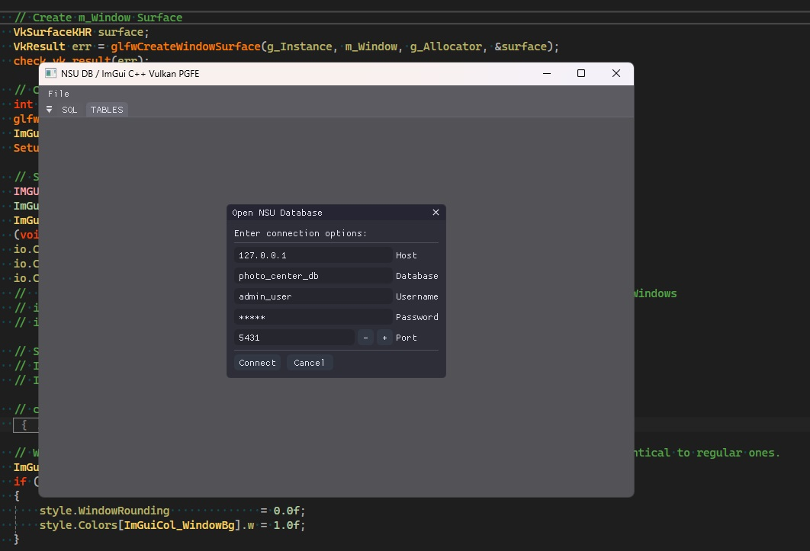
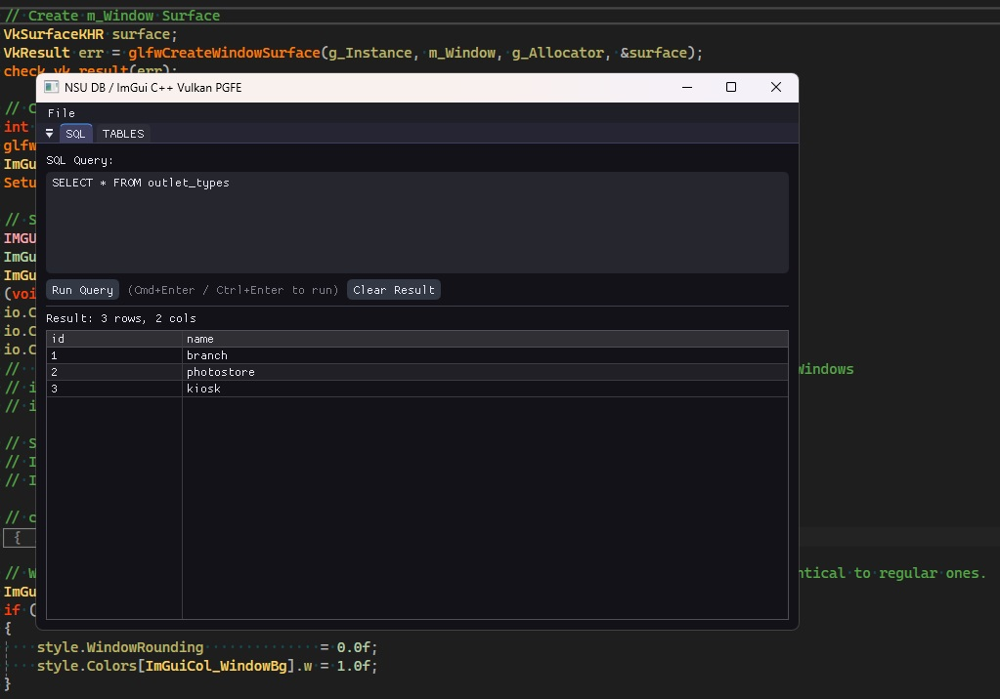

# NSU_DB

A C++ client-server application for interacting with a PostgreSQL database using [pgfe](https://github.com/dmitigr/pgfe) and a modern GUI built with [ImGui](https://github.com/ocornut/imgui).

---

## 🐘 Database Setup

### 🔧 Boot PostgreSQL

```bash
cd database
docker-compose up -d
```

This starts a PostgreSQL container using the `docker-compose.yml` configuration.

### 🛑 Stop the Database

```bash
docker-compose down -v
```

> 💡 Data isn't persisted via the `data/` volume folder.

---

## 🛠️ Build the Application

### ⚙️ Using CMake (Manual Steps)

```bash
cd client && mkdir build && cd build && cmake -DCMAKE_BUILD_TYPE=Release .. && cmake --build . --config Release
```

### ▶️ Using Provided Script

On Windows, you can also run:

```bash
BUILD_APP.bat
```

This will invoke the build process as defined for your environment.

## Features

You can connect to PostgreSQL database.


You can enter SQL queries and see the results in a table.


You can browse each table in the database, optionally filtering the results.
